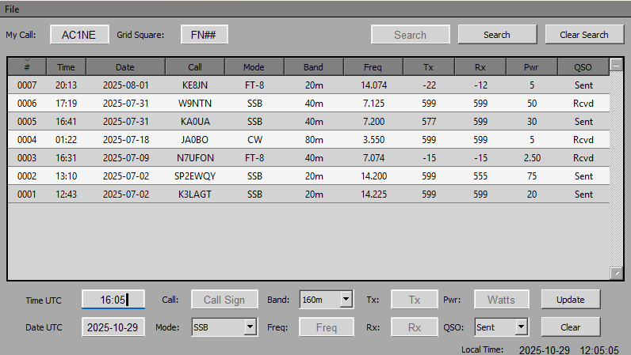

# LHL
LHL Amateur Radio Log: A PyQt5 desktop application to log, manage, and export ham radio contacts with real-time UTC/local time, search, edit, and ADIF export functionality.

# AI Disclosure
Some portions of the code, including organization, syntax improvements, and commenting, were assisted using AI tools. All functional logic and design decisions were created and reviewed by the repository author.

# Requirements
 
  -git             https://git-scm.com/download  
  -Python 3.xx     https://www.python.org/downloads/windows  
  -PyQT5           pip install PyQt5

# Main Functions
  - Create and Manage Log Files Using .JSON format
  - Record amateur Radio Contacts with Details
      - UTC Time and Date
      - Call Sign
      - Mode (SSB, CW, AM, FM, FT-8, WSPR)
      - Band (160m, 80m, 40m, etc.)
      - Frequency, TX, RX, Power, Status
  - Edit and Update Entries in an Intuitive Table Interface
  - Search and Filter Log Entries
  - Export Log as ADIF Format for External Amateur Radio Logging Tools

# Table Features
  - Cell Delegates for proper validation and formating
  - Sorting by Alpha or Numeric Entries
  - Row Deletion with Confirmation Prompts
  - Highlighted Editing to Prevent Accidental Changes

# Time and Date
  - Displays Local Time Continuously
  - Updates UTC in Real Time
  - Handles Automatic Date Rollovers at Midnight UTC
  - Pauses Time Update When Fields are Edited (Reinitializes Time Update When Form is Cleared)

# File Handling
  - Creates JSON Log File with Manditory My Call and Grid Square
  - Loads Existing Log and Populates Table
  - Auto Saves New Log Entries
  - Toggle Edit Mode to Modify Existing Entries
  - Export Entries to an ADIF (.adi) Format for Use with Web Logs Like QRZ
  - Avoides Re-export of Existing Entries

# Installation
  Ensure you have all requirments installed
   * Mac is untested but should work 
   * If Resolution Scaling is Off see [Known Issues](Known_Issues.md)

  # Windows, Linux, Mac   
        
          git clone https://github.com/Ac1ne/LHL.git
          cd LHL
          python LHL.py     
          
  --- Mac Use python3 LHL.py ---
  
